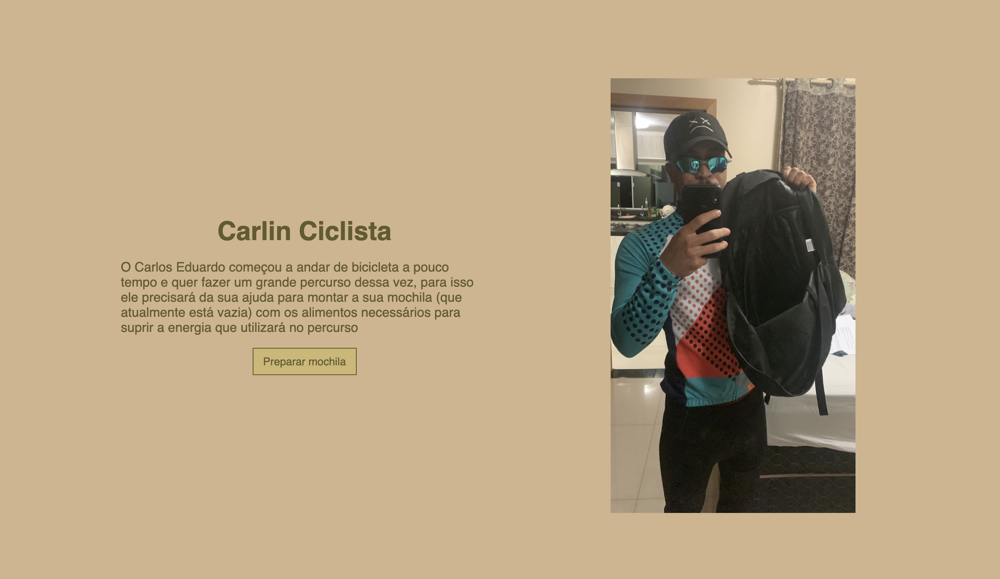
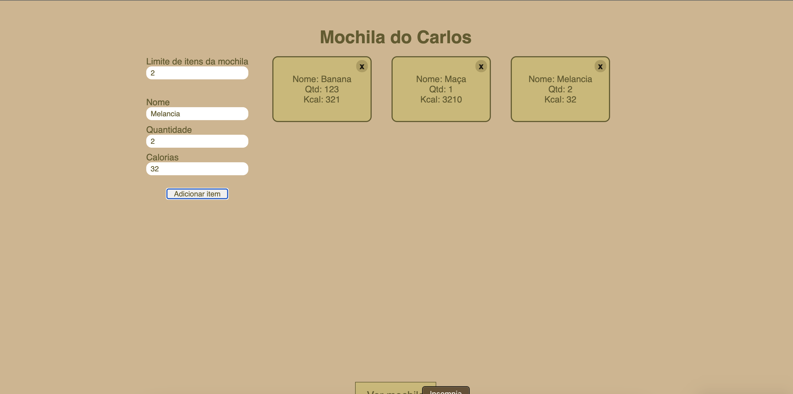
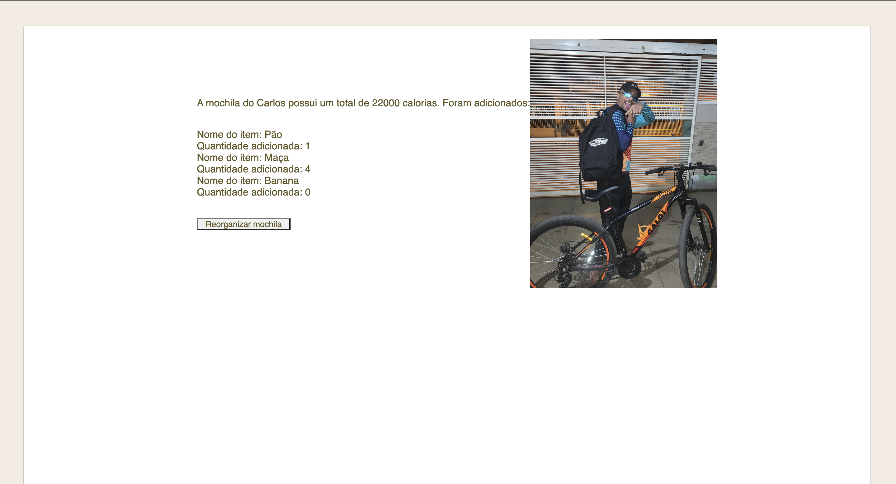

Tema:

- Greed

# Maior mochila possivel

<!-- **Número da Lista**: 1<br> -->

**Conteúdo da Disciplina**: Algoritmos Ambiciosos<br>

## Alunos

| Matrícula  | Aluno          |
| ---------- | -------------- |
| 19/0011424 | Carlos Eduardo |
| 19/0011611 | Ciro Costa     |

## Sobre

O nosso projeto é basicamente como achar a mochila com maior número de calorias possível para o Ciclista Carlin pelo meio do algoritmo Knapsack.

## Screenshots





## Vídeo demo

[!Video demografia](https://github.com/projeto-de-algoritmos/Greed_CarlinCilcista/assets/54088490/98b83bc8-44ba-413b-a5e7-3250ee406766)

## Instalação

**Linguagem**: JavaScript<br>
**Framework**: React<br>

Necessário:

- git
- node

Clone o repositório.
Dentro da pasta AMBICIOSOS/ciclista
instale os pacotes

```
npm install
```

rode o projeto

```
npm run start
```

## Uso

<p>Insira o número de itens que a mochila aguenta </p>
<p>Insira os itens disponíveis</p>
<p>Clique em ver mochila para ver quais itens e quantos levar, sucesso :)</p>
