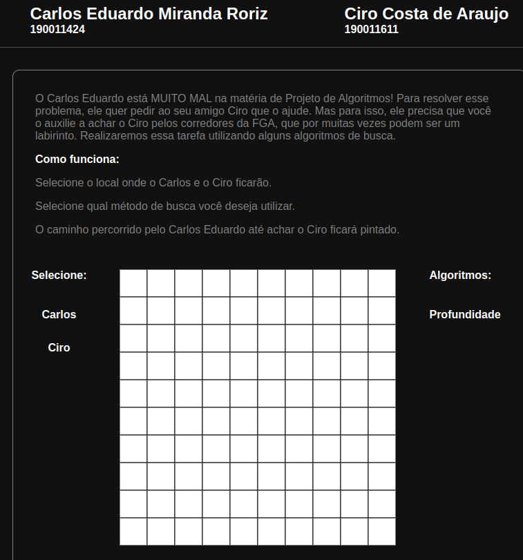

Tema:

- Grafos1

# Labirinto

Link do pages: https://caduroriz.github.io/PA-2023-01/
**Número da Lista**: 1 
**Conteúdo da Disciplina**: Grafos 

## Alunos

| Matrícula  | Aluno          |
| ---------- | -------------- |
| 19/0011424 | Carlos Eduardo |
| 19/0011611 | Ciro Costa     |

## Sobre

O nosso projeto é um labirinto. O usuário seleciona o ponto de partida, o ponto de chegada, além de colocar obstáculos onde desejar. Após isso, seleciona qual algoritmo de busca deseja utilizar(nesta primeiro projeto só há 1 algoritmo, o de busca) e o caminho feito pelo algoritmo no labirinto é mostrado.

## Screenshots

## Instalação

**Linguagem**: JavaScript 

## Uso

 
Selecione o local onde será o ponto de partida e o ponto de chegada. 

                        
Selecione qual método de busca você deseja utilizar.(por enquanto apenas por profundidade)

                        
O caminho percorrido até o ponto de chegada ficará colorido 

-----------------------------------------------------------------------------------------------

Caso o pages esteja bugado, apenas clone o repositório e abra o index.html pelo seu navegador. Não há necessidade de fazer qualquer tipo de instalação.

